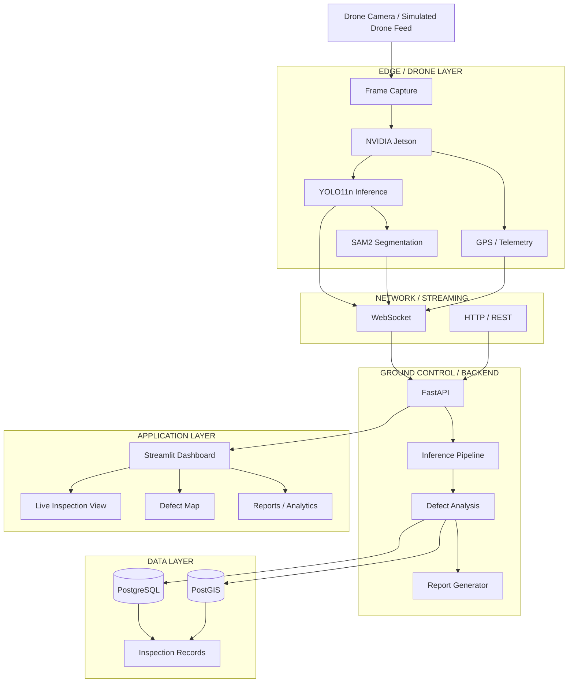
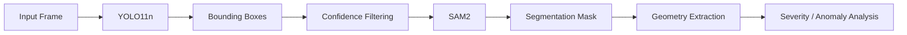
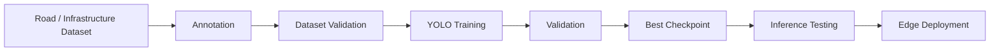

# DRIFT — Drone-based Reconnaissance & Infrastructure Fault Tracking

<p align="center">

**An AI-powered aerial infrastructure inspection and defect intelligence platform**

**Track 2  ·  PS2 — Drone Infrastructure Inspector**

<br>

[](https://www.python.org/)
[](https://pytorch.org/)
[](https://github.com/ultralytics/ultralytics)
[](https://fastapi.tiangolo.com/)
[](https://postgis.net/)
[](https://www.docker.com/)
[](https://developer.nvidia.com/cuda-zone)

</p>

---

## Drone 3D Model


https://github.com/user-attachments/assets/1b2d3cd5-95ee-44e7-9e67-9fbb83333e8b


<p align="center">
  <video
    src="https://github.com/user-attachments/assets/21e5712e-7260-4e8f-bb22-8cbd3a7146d8", autoplay
    muted
    loop
    playsinline
    controls
    width="700">
  </video>
</p>

<p align="center">
  <em>Drone 3D Model</em>
</p>

## ML Model Output Images : 


## 1. Overview

**DRIFT** is a drone-based AI infrastructure inspection system designed to automate the detection, localization, segmentation, and reporting of road and civil-infrastructure defects from aerial imagery.

The system combines:

* Custom-trained **YOLO11** object detection
* **SAM2**-based visual segmentation
* GPU-accelerated inference using **PyTorch + CUDA**
* Real-time/near-real-time frame ingestion
* GPS-aware defect localization
* **FastAPI** backend services
* **WebSocket** communication for streaming data
* **PostgreSQL + PostGIS** spatial persistence
* **Streamlit** inspection dashboard
* NVIDIA Jetson-compatible edge inference architecture
* Automated inspection/report generation
* Simulated drone feeds for development without physical drone hardware

The objective is to transform drone imagery into **structured, geospatially indexed infrastructure intelligence** rather than simply returning bounding boxes on individual images.

---

# 2. Problem Statement

## The Problem

Traditional road and infrastructure inspection is heavily dependent on:

* Manual field surveys
* Periodic physical inspections
* Human interpretation of images
* Non-standardized reporting
* Limited spatial traceability
* Delayed identification of infrastructure deterioration

These approaches become difficult to scale across large road networks.

A drone can collect large amounts of high-resolution visual data, but raw imagery alone does not solve the inspection problem.

The actual challenge is:

> **How can aerial imagery be converted into automatically detected, localized, segmented, and actionable infrastructure defects at scale?**


# 4. System Architecture

## High-Level Architecture




DRIFT addresses this by creating an end-to-end pipeline:

```text
Drone / Simulated Drone Feed
            │
            ▼
       Frame Ingestion
            │
            ▼
     AI Object Detection
        YOLO11n
            │
            ▼
    Defect Localization
            │
            ▼
       SAM2 Segmentation
            │
            ▼
   Severity / Anomaly Analysis
            │
            ▼
     GPS / Spatial Mapping
            │
            ▼
      PostgreSQL + PostGIS
            │
            ▼
       FastAPI Services
            │
            ▼
      Live Dashboard
            │
            ▼
     Inspection Reports
```
# 47. Project Architecture at a Glance

```text
                         DRIFT
                          │
          ┌───────────────┼────────────────┐
          │               │                │
          ▼               ▼                ▼
       EDGE AI         BACKEND           DATA
          │               │                │
      YOLO11n          FastAPI         PostgreSQL
          │               │                │
        SAM2          WebSocket         PostGIS
          │               │                │
       GPS/MAVLink      Reports        Spatial Data
          │               │                │
          └───────────────┼────────────────┘
                          │
                          ▼
                     DASHBOARD
                          │
              ┌───────────┼───────────┐
              ▼           ▼           ▼
           Live View     Map       Analytics
                          │
                          ▼
                       Reports
```

---

# 3. Core Objectives

DRIFT is designed around five primary objectives.

### 1. Automated Detection

Identify infrastructure defects from drone imagery using a custom-trained object detector.

### 2. Pixel-Level Localization

Move beyond rectangular bounding boxes by obtaining segmentation masks for detected structures/defects.

### 3. Geospatial Intelligence

Associate detected defects with geographic coordinates and persist them as spatial entities.

### 4. Real-Time Inspection

Support continuous frame ingestion and WebSocket-based communication between the edge device, backend, and dashboard.

### 5. Automated Reporting

Convert detected infrastructure anomalies into structured inspection records suitable for downstream analysis and maintenance workflows.

---

---

# 5. Detailed Data Flow

A typical inspection cycle follows the following pipeline:

```text
                  ┌─────────────────┐
                  │ Drone / Camera  │
                  └────────┬────────┘
                           │
                           ▼
                  ┌─────────────────┐
                  │ Image / Frame   │
                  │ Acquisition     │
                  └────────┬────────┘
                           │
                           ▼
              ┌──────────────────────────┐
              │ YOLO11 Custom Detector   │
              │                          │
              │ Bounding Boxes           │
              │ Classes                  │
              │ Confidence Scores        │
              └────────────┬─────────────┘
                           │
                           ▼
              ┌──────────────────────────┐
              │ SAM2 Segmentation        │
              │                          │
              │ Pixel-level masks        │
              │ Object boundaries        │
              └────────────┬─────────────┘
                           │
                           ▼
              ┌──────────────────────────┐
              │ Defect Analysis          │
              │                          │
              │ Class                    │
              │ Confidence               │
              │ Area / geometry          │
              │ Severity                 │
              └────────────┬─────────────┘
                           │
                    GPS / Telemetry
                           │
                           ▼
              ┌──────────────────────────┐
              │ Geospatial Mapping       │
              │                          │
              │ Latitude                 │
              │ Longitude                │
              │ Spatial geometry         │
              └────────────┬─────────────┘
                           │
                           ▼
              ┌──────────────────────────┐
              │ PostgreSQL + PostGIS     │
              └────────────┬─────────────┘
                           │
                           ▼
              ┌──────────────────────────┐
              │ FastAPI API Layer        │
              └────────────┬─────────────┘
                           │
                           ▼
              ┌──────────────────────────┐
              │ Streamlit Dashboard      │
              └──────────────────────────┘
```

---

# 6. Machine Learning Pipeline

## 6.1 Custom YOLO11 Model

The core detection model used by DRIFT is a custom-trained **YOLO11n** model.

The repository contains:

```text
drift_yolo11n.pt
```

and the associated training notebook:

```text
drift_YOLOv11n_Training.ipynb
```

The model is intended to detect road/infrastructure defects directly from aerial imagery.

### Detection output

For each detected object, the model produces:

```text
Class
Bounding Box
Confidence
Frame ID
Image Coordinates
```

Conceptually:

```python
{
    "class": "road_defect",
    "confidence": 0.91,
    "bbox": [x1, y1, x2, y2],
    "frame_id": 142
}
```

The trained model provides the first stage of the visual intelligence pipeline.

---

# 7. ML Training Pipeline

The model-training workflow follows the standard supervised object-detection pipeline:

```text
Raw Road / Infrastructure Dataset
              │
              ▼
      Dataset Inspection
              │
              ▼
       Annotation Validation
              │
              ▼
      Train / Validation Split
              │
              ▼
       YOLO Dataset Format
              │
              ▼
       YOLO11n Fine-Tuning
              │
              ▼
     Validation / Evaluation
              │
              ▼
      Best Model Checkpoint
              │
              ▼
       drift_yolo11n.pt
              │
              ▼
       Deployment / Inference
```

The training setup was designed around aerial/road-defect imagery and follows the YOLO annotation convention:

```text
class_id x_center y_center width height
```

with normalized coordinates.

---

# 8. Why YOLO11n?

The system is intended for deployment on resource-constrained edge hardware.

A large detection model may provide higher accuracy at the cost of:

* Increased latency
* Increased VRAM consumption
* Increased power consumption
* Reduced edge-device throughput

Therefore, the project uses the lightweight **YOLO11n** architecture as the detection backbone.

This provides a practical trade-off between:

```text
Detection Accuracy
        ↕
Inference Latency
        ↕
Model Size
        ↕
Edge Hardware Constraints
```

This is particularly important for the intended NVIDIA Jetson deployment.

---

# 9. SAM2 Segmentation

Object detection provides a bounding box, but infrastructure inspection often requires more precise geometry.

DRIFT therefore incorporates **SAM2** for segmentation.

The conceptual pipeline is:

```text
YOLO Detection
      │
      │ Bounding Box
      ▼
┌───────────────┐
│     SAM2      │
│  Segmentation │
└───────┬───────┘
        │
        ▼
Pixel-Level Mask
        │
        ▼
Defect Geometry
```

This allows the system to move from:

```text
"This region contains a defect"
```

towards:

```text
"This specific set of pixels corresponds to the detected defect."
```

SAM2 is particularly useful when downstream processing requires shape, area, boundary, or spatial measurements. The YOLO → segmentation approach is also consistent with established approaches of using detections as prompts for segmentation.

---

# 10. Detection + Segmentation Architecture



This two-stage architecture separates:

### Detection

**Where is the defect?**

from:

### Segmentation

**What exact pixels belong to the defect?**

This separation provides more flexibility than relying exclusively on a single segmentation model.

---

# 11. Geospatial Intelligence

A major component of DRIFT is the connection between computer vision output and geographic information.

A detected defect is not treated merely as an image annotation.

It can be associated with:

```text
Latitude
Longitude
Timestamp
Frame ID
Detection Class
Confidence
Bounding Box
Segmentation Geometry
Inspection ID
```

This enables infrastructure defects to become spatially queryable records.

---

# 12. PostgreSQL + PostGIS

DRIFT uses PostgreSQL with PostGIS for persistent storage.

The Docker configuration uses:

```yaml
image: postgis/postgis:16-3.4
```

The database is configured as:

```text
Database : DRIFT_db
User     : DRIFT_user
Port     : 5432
```

The spatial database enables queries such as:

```text
Find all defects within a geographic region.

Find defects within X metres of a road segment.

Find repeated defects from multiple inspection flights.

Find high-severity defects in a specific administrative area.
```

This is an important distinction from storing inspection results only in JSON/CSV files.

The system can treat infrastructure inspection as a **spatial data problem**.

---

# 13. Backend Architecture

The backend is implemented using **FastAPI**.

Responsibilities include:

* REST API endpoints
* WebSocket communication
* Inference orchestration
* Frame handling
* Detection processing
* Database interaction
* Inspection persistence
* Report generation
* Health/status endpoints

Architecture:

```text
                ┌─────────────────────┐
                │       FastAPI       │
                └──────────┬──────────┘
                           │
          ┌────────────────┼────────────────┐
          │                │                │
          ▼                ▼                ▼
     REST APIs        WebSockets       Inspection
                                          Logic
          │                │                │
          └────────────────┼────────────────┘
                           │
                           ▼
                  Inference Pipeline
                           │
                           ▼
                 PostgreSQL / PostGIS
```

---

# 14. WebSocket Streaming

For live inspection, the system supports streaming communication.

The intended communication path is:

```text
Jetson / Simulated Drone
          │
          │ WebSocket
          ▼
       FastAPI
          │
          ├──────────────► Database
          │
          └──────────────► Dashboard
```

This avoids treating every frame as an independent offline prediction request.

Instead, the backend can maintain an ongoing inspection session.

---

# 15. Edge Computing Architecture

DRIFT is designed around a **cloud/GCS + edge inference** architecture.

### Edge

The NVIDIA Jetson is intended to perform compute-intensive operations close to the camera:

```text
Camera
  ↓
Jetson
  ↓
YOLO11n
  ↓
SAM2
  ↓
Detection / Segmentation
  ↓
Telemetry + Results
```

### Ground Control / Backend

The backend manages:

```text
API
Database
Inspection Sessions
Visualization
Reports
Historical Data
```

This reduces the amount of raw data that necessarily needs to travel through the network.

---

# 16. Jetson Deployment

The repository contains Jetson-specific components including:

```text
jetson_client.py
jetson_test_sender.py
```

and a configurable MAVLink serial interface:

```env
MAVLINK_SERIAL=/dev/ttyTHS1
```

The intended production topology is:

```text
                 ┌──────────────────┐
                 │     DRONE        │
                 │ Camera + GPS     │
                 └────────┬─────────┘
                          │
                          ▼
                 ┌──────────────────┐
                 │ NVIDIA JETSON    │
                 │                  │
                 │ YOLO11n          │
                 │ SAM2             │
                 │ Edge inference   │
                 └────────┬─────────┘
                          │
                   Wi-Fi / Network
                          │
                          ▼
                 ┌──────────────────┐
                 │ GROUND CONTROL   │
                 │                  │
                 │ FastAPI          │
                 │ PostgreSQL       │
                 │ Streamlit        │
                 └──────────────────┘
```

The Jetson is **not required for local software development**.

The repository also provides simulated/test clients so the backend can be developed and tested without physical flight hardware.

---

# 17. Local Development Without a Jetson

DRIFT supports local development through simulated drone communication.

This allows developers to test:

```text
Backend
      ↓
WebSocket
      ↓
Simulated Drone
      ↓
Frames / Telemetry
      ↓
Inference
      ↓
Database
      ↓
Dashboard
```

Therefore, a physical Jetson is a **deployment target**, not a mandatory development dependency.

---

# 18. LLM / Ollama Layer

The architecture also provides configuration for an optional local LLM service:

```env
OLLAMA_HOST=localhost
OLLAMA_PORT=11434
```

Ollama can be used as an auxiliary intelligence layer for inspection analysis, natural-language summaries, or report generation.

Importantly:

> The core computer-vision pipeline does not depend on a physical Jetson or necessarily on Ollama for basic detection and inspection processing.

The essential pipeline is:

```text
Frame
 ↓
YOLO
 ↓
SAM2
 ↓
Spatial Processing
 ↓
Database
 ↓
Dashboard
```

while the LLM layer can operate as an additional intelligence/reporting component.

---

# 19. Dashboard

DRIFT provides a Streamlit-based inspection dashboard.

The dashboard is intended to expose:

* Live inspection information
* Detection results
* Infrastructure defect locations
* Geographic visualization
* Confidence values
* Inspection history
* Generated reports
* System status

Launch using:

```bash
streamlit run dashboard/app.py
```

### Dashboard output

```text
┌──────────────────────────────────────────────────────────────┐
│                         DRIFT                                │
├───────────────────────┬──────────────────────────────────────┤
│ Live Drone Feed       │ Infrastructure Map                   │
│                       │                                      │
│  [DETECTED DEFECT]    │      ● defect                        │
│                       │          ● defect                    │
│ Confidence: 0.91      │               ● defect               │
│ Class: Road Damage    │                                      │
├───────────────────────┴──────────────────────────────────────┤
│ Inspection Statistics                                        │
│ Total Defects | Critical | Moderate | Inspected Area        │
└──────────────────────────────────────────────────────────────┘
```

---

# 20. Expected Inspection Output

A processed inspection frame can conceptually produce:

```json
{
  "inspection_id": "INS-001",
  "frame_id": 142,
  "timestamp": "2026-08-11T12:30:21Z",
  "detections": [
    {
      "class": "road_defect",
      "confidence": 0.91,
      "bbox": [412, 201, 703, 498],
      "latitude": 28.6139,
      "longitude": 77.2090
    }
  ]
}
```

The exact schema depends on the current backend implementation.

---

# 21. Automated Reporting

The backend contains report-generation functionality intended to transform raw inspection results into structured inspection outputs.

A report can conceptually contain:

```text
Inspection ID
────────────────────────────
Inspection Date
Flight / Mission
Geographical Area

Detected Defects
────────────────────────────
Defect Type
Confidence
Location
Severity
Image Evidence

Spatial Summary
────────────────────────────
Total defects
Defects / km²
High-priority locations
Inspection coverage
```

This creates a path from:

**raw drone imagery → AI inference → engineering report**

rather than ending at model predictions.

---

# 22. Technology Stack

| Layer            | Technology                | Purpose                           |
| ---------------- | ------------------------- | --------------------------------- |
| Programming      | Python 3.11               | Core implementation               |
| Deep Learning    | PyTorch                   | Model execution/training          |
| GPU              | NVIDIA CUDA               | GPU acceleration                  |
| Object Detection | YOLO11n                   | Infrastructure defect detection   |
| Segmentation     | SAM2                      | Pixel-level segmentation          |
| Computer Vision  | OpenCV                    | Image/frame processing            |
| Model Utilities  | Ultralytics               | YOLO training/inference           |
| Backend          | FastAPI                   | REST + application server         |
| Server           | Uvicorn                   | ASGI runtime                      |
| Streaming        | WebSockets                | Real-time communication           |
| Database         | PostgreSQL                | Persistent storage                |
| Spatial DB       | PostGIS                   | Geospatial queries                |
| Frontend         | Streamlit                 | Inspection dashboard              |
| Mapping          | Folium / Streamlit-Folium | Geospatial visualization          |
| Analytics        | Plotly                    | Interactive visualization         |
| Reports          | ReportLab                 | Report generation                 |
| Containers       | Docker Compose            | Database/environment deployment   |
| Edge Hardware    | NVIDIA Jetson             | Target edge inference platform    |
| LLM              | Ollama                    | Optional local AI/reporting layer |

---


---

# 24. Configuration

Create the environment file:

```bash
cp .env.example .env
```

For Windows PowerShell:

```powershell
Copy-Item .env.example .env
```

A local development configuration can contain:

```env
GCS_HOST=localhost
GCS_PORT=8000

JETSON_HOST=localhost
RECEIVER_PORT=8001

MAVLINK_SERIAL=/dev/ttyTHS1

OLLAMA_HOST=localhost
OLLAMA_PORT=11434

DB_HOST=localhost
DB_PORT=5432
DB_NAME=DRIFT_db
DB_USER=DRIFT_user
DB_PASSWORD=DRIFT
```

When running locally without Jetson hardware, the Jetson-specific values are not required for basic backend development.

---

# 25. Database Deployment

DRIFT uses Docker Compose to provision PostgreSQL/PostGIS.

```bash
docker compose up -d
```

Verify:

```bash
docker compose ps
```

Expected:

```text
db    postgis/postgis:16-3.4    Up (healthy)
```

The database configuration is:

```text
Host:     localhost
Port:     5432
Database: DRIFT_db
User:     DRIFT_user
Password: DRIFT
```

---

# 26. Backend Installation

Recommended environment:

```bash
python -m venv .venv
```

Windows:

```powershell
.venv\Scripts\Activate.ps1
```

Linux/macOS:

```bash
source .venv/bin/activate
```

Install dependencies:

```bash
pip install -r requirements.txt
```

For an NVIDIA CUDA development machine, install a compatible CUDA-enabled PyTorch build where appropriate.

Example:

```bash
python -m pip install torch==2.7.1 torchvision==0.22.1 --index-url https://download.pytorch.org/whl/cu118
```

Verify CUDA:

```python
import torch

print(torch.cuda.is_available())
print(torch.cuda.get_device_name(0) if torch.cuda.is_available() else "CPU")
```

---

# 27. Running the Backend

Start PostgreSQL/PostGIS first:

```bash
docker compose up -d
```

Then:

```bash
python run.py
```

The backend is exposed at:

```text
http://localhost:8000
```

FastAPI documentation:

```text
http://localhost:8000/docs
```

---

# 28. Running the Dashboard

In a second terminal:

```bash
streamlit run dashboard/app.py
```

The dashboard can then communicate with the running FastAPI backend.

---

# 29. Running the Complete Local Stack

```text
Terminal 1
──────────────────────────────
docker compose up -d


Terminal 2
──────────────────────────────
.venv\Scripts\Activate.ps1
python run.py


Terminal 3
──────────────────────────────
.venv\Scripts\Activate.ps1
streamlit run dashboard/app.py
```

Result:

```text
             ┌──────────────────┐
             │ PostgreSQL/PostGIS│
             │     :5432        │
             └────────▲─────────┘
                      │
                      │
┌─────────────┐      │      ┌─────────────────┐
│ Streamlit   │◄─────┼─────►│ FastAPI :8000  │
│ Dashboard   │             │                 │
└─────────────┘             └────────┬────────┘
                                     │
                                     ▼
                              YOLO11n + SAM2
```

---

# 30. Development Without Physical Hardware

The system can be developed without:

* A physical drone
* NVIDIA Jetson
* MAVLink flight controller
* Ollama

The minimum local stack is:

```text
Windows/Linux PC
      │
      ├── Python
      ├── PyTorch + CUDA
      ├── YOLO11n
      ├── SAM2
      ├── FastAPI
      ├── Streamlit
      │
      └── Docker
            │
            └── PostgreSQL + PostGIS
```

Simulated drone utilities can be used to test communication and inspection workflows.

---

# 31. Hardware Deployment

The intended field architecture is:

### Drone

```text
Camera
GPS
Flight Controller
       │
       ▼
NVIDIA Jetson
```

### Jetson

```text
Video Capture
      ↓
YOLO11n
      ↓
SAM2
      ↓
Detection + Segmentation
      ↓
Telemetry
      ↓
WebSocket
```

### Ground Station

```text
FastAPI
   │
   ├── PostgreSQL/PostGIS
   │
   ├── Dashboard
   │
   └── Reporting
```

This allows compute-intensive AI processing to happen at the edge while historical inspection data and visualization remain available at the ground station.

---

# 32. Why Edge AI?

Sending every high-resolution drone frame to a remote server introduces:

* Network bandwidth requirements
* Transmission latency
* Connectivity dependency
* Privacy/security considerations
* Reduced autonomy

Edge inference allows:

```text
Camera
  ↓
Jetson
  ↓
AI inference
  ↓
Relevant metadata/results
  ↓
Ground station
```

Instead of:

```text
Camera
  ↓
Entire video stream
  ↓
Remote server
  ↓
AI inference
```

This architecture is particularly relevant for field deployments where network conditions may be unreliable.

---

# 33. Infrastructure Intelligence Layer

The long-term objective is not simply object detection.

DRIFT is designed as a progression:

```text
LEVEL 1
Visual Detection
        ↓
LEVEL 2
Segmentation
        ↓
LEVEL 3
Geospatial Localization
        ↓
LEVEL 4
Severity / Anomaly Analysis
        ↓
LEVEL 5
Historical Infrastructure Intelligence
        ↓
LEVEL 6
Predictive Maintenance
```

This creates the foundation for future capabilities such as:

* Repeated defect tracking
* Infrastructure deterioration monitoring
* Temporal comparison of inspection flights
* Maintenance prioritization
* Risk-based road inspection
* Predictive maintenance
* Infrastructure health scoring

---

# 34. Multi-Query / Open-Vocabulary Extension

The repository also contains:

```text
multi_query_yoloworld.py
MULTI_QUERY.md
```

which provides an experimental direction toward query-based/open-vocabulary detection.

This can enable inspection workflows where the operator specifies a target concept rather than relying exclusively on a fixed detection class list.

Conceptually:

```text
Operator Query
      │
      ▼
"Find cracks and damaged road surfaces"
      │
      ▼
Open-Vocabulary Detection
      │
      ▼
Candidate Regions
      │
      ▼
Segmentation / Analysis
```

This is an extension of the fixed-class YOLO pipeline rather than a replacement for the trained detector.

---

# 35. Model Development Lifecycle



The repository preserves the training notebook:

```text
drift_YOLOv11n_Training.ipynb
```

and trained weights:

```text
drift_yolo11n.pt
```

so model development and deployment remain reproducible components of the project.

---

# 36. Evaluation Strategy

Model evaluation should consider both ML performance and system performance.

## ML Metrics

```text
Precision
Recall
mAP@50
mAP@50:95
Confusion Matrix
Per-class AP
```

## System Metrics

```text
Inference latency
Frames per second
GPU utilization
Memory consumption
End-to-end frame latency
Network latency
Database write latency
```

## Deployment Metrics

```text
Jetson FPS
Jetson memory utilization
Power consumption
Thermal stability
Detection latency
```

A production-ready evaluation should therefore not optimize only for mAP.

The practical objective is:

```text
Accuracy × Speed × Resource Efficiency × Reliability
```


# 39. Project Status

| Component                      | Status                            |
| ------------------------------ | --------------------------------- |
| FastAPI backend                | ✅ Implemented                     |
| Streamlit dashboard            | ✅ Implemented                     |
| PostgreSQL/PostGIS integration | ✅ Implemented                     |
| Docker database deployment     | ✅ Implemented                     |
| YOLO11 custom model            | ✅ Trained / integrated            |
| YOLO inference                 | ✅ Implemented                     |
| SAM2 segmentation              | ✅ Integrated                      |
| WebSocket communication        | ✅ Implemented                     |
| Simulated drone testing        | ✅ Supported                       |
| GPS/geospatial pipeline        | 🟡 Integration/testing            |
| Automated reporting            | 🟡 Implemented / under refinement |
| Jetson deployment              | 🟡 Target architecture            |
| Physical drone integration     | 🟡 Hardware dependent             |
| Ollama/LLM layer               | 🟡 Optional extension             |
| Large-scale field validation   | 🔜 Future phase                   |
| Predictive maintenance         | 🔜 Future phase                   |

---


# 42. Security and Reliability Considerations

A field-deployed infrastructure system must account for:

* Authentication
* API authorization
* Secure WebSocket communication
* Environment-variable based secrets
* Database access control
* Input validation
* Model integrity
* Logging
* Failure recovery
* Offline/unstable-network operation

Production deployments should never commit:

```text
.env
database passwords
API keys
private certificates
cloud credentials
```

to the repository.

---

# 43. Reproducibility

The project preserves:

```text
Training notebook
       +
Model weights
       +
requirements.txt
       +
Docker configuration
       +
Environment template
       +
Test utilities
```

This allows the ML and application stack to be reconstructed independently.

---


# 45. Key Technical Contributions

### Computer Vision

Custom YOLO11-based infrastructure defect detection.

### Segmentation

SAM2-based pixel-level refinement of detected regions.

### Edge AI

Architecture optimized for NVIDIA Jetson-class deployment.

### Real-Time Systems

WebSocket-based streaming and asynchronous backend processing.

### Geospatial Computing

PostGIS-backed spatial storage and inspection mapping.

### Full-Stack Engineering

FastAPI backend + Streamlit visualization + PostgreSQL/PostGIS.

### Simulation

Hardware-independent development through simulated drone feeds.

### ML-to-Deployment Pipeline

The trained model is not isolated in a notebook; it is integrated into an operational inference architecture.


---


## Team 

**DRIFT — Drone-based Real-time Infrastructure Fault Tracking**

Developed as a Smart India Hackathon-oriented solution for AI-assisted infrastructure inspection, combining computer vision, edge computing, geospatial intelligence, real-time systems, and automated reporting.

---


## Acknowledgements

This project builds upon open-source technologies including:

* PyTorch
* Ultralytics YOLO
* SAM2
* FastAPI
* PostgreSQL
* PostGIS
* Streamlit
* Docker
* OpenCV

